## Procedure

Please follow these steps to do the experiment.

## Part 1:

1. At first go through the structure of 74138. Then apply  high level voltage to VCC  and apply low level voltage  to GND  and also apply  high level voltage to G1.

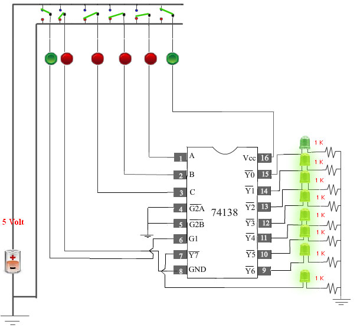
                              
2. Next, apply low level voltage  to all the three select inputs (C B A). Now check that Y0 is at low state. Other outputs are at high state.

                                

3. Next,  apply low level voltage  to C  and  B  and apply  high level voltage to A.Now check that 
 Y1 is at low state. Other outputs are at high state.

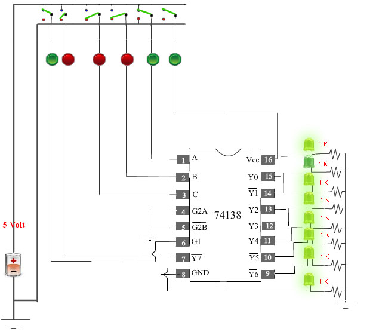

4. Next,  apply low level voltage  to  C  and A  and apply  high level voltage to B.Now check that 
 Y2 is at low state. Other outputs are at high state.

                                
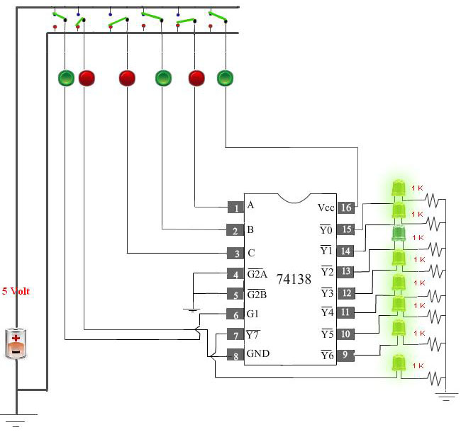
                            
5. Next,  apply low level voltage  to  C  and apply  high level voltage to B  and A. Now check that Y3 is at low state. Other outputs are at high state.
                  
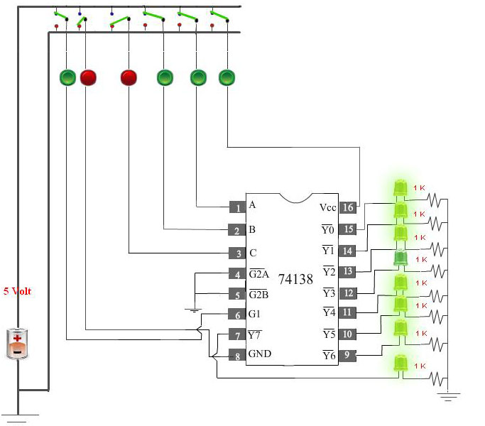
                            
6. Next,  apply  high level voltage to  C  and apply low level voltage  to B and A. Now check that 
Y4 is at low state. Other outputs are at high state.
                    
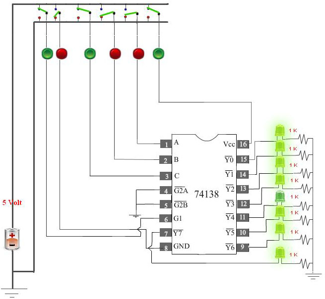
                            
7. Next,  apply  high level voltage to C and A and apply low level voltage  to B.Now check that
Y5 is at low state. Other outputs are at high state.
                    
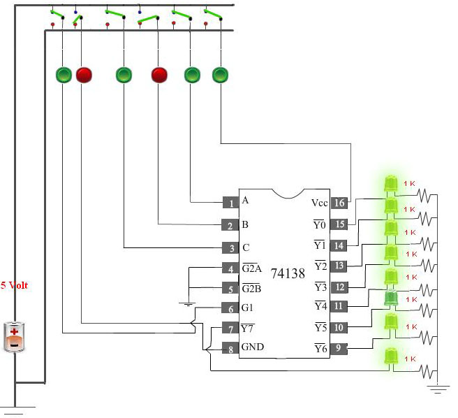
                               
8. Next,  apply  high level voltage to  C and B high  and apply low level voltage  to A.  Now check that 
  Y6 is at low state. Other outputs are at high state.
            
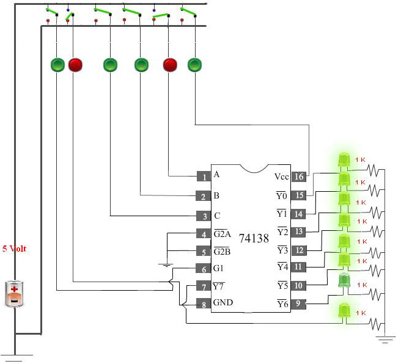
                              
9. Next,  apply  high level voltage to all the select inputs (C,B,A). Now check that
  Y7 is at low state. Other outputs are at high state.
                      
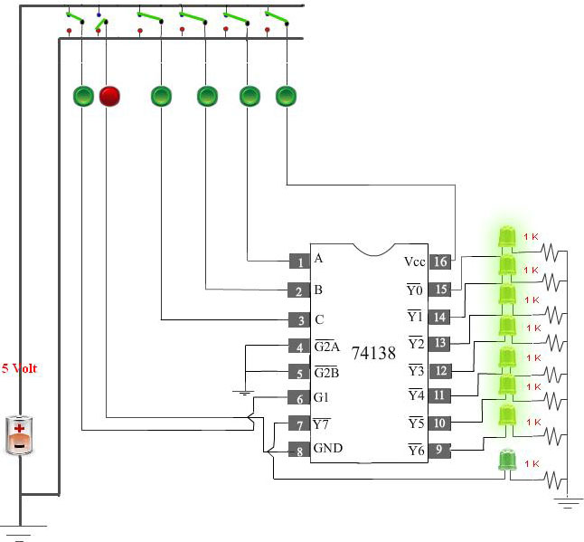
                             
#### Please follow these steps to do the experiment(Part2).
                               
                               
1. At first  apply  high level voltage to VCC  and apply low level voltage to GND andapply  high level voltage to  G1 input of 1st decoder.

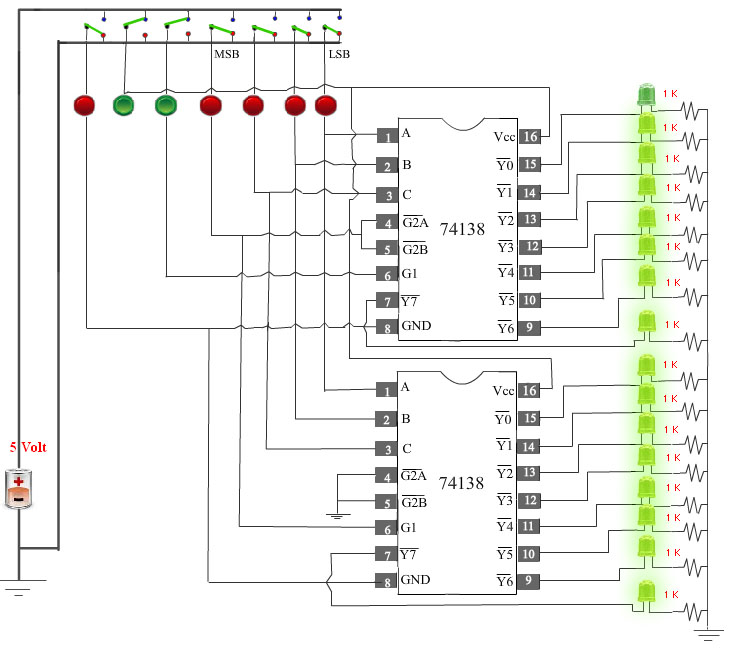
                              
2. Next,  apply low level voltage to all the four select inputs (MSB,C B A).Now check that 
Y0 (1st Decoder) is at low state. Other outputs are at high state.

                                

                            
3. Next,  apply  high level voltage to  A and apply low level voltage to all other select inputs (MSB,C B).Now check that
Y1 (1st Decoder) is at low state. Other outputs are at high state.
                            
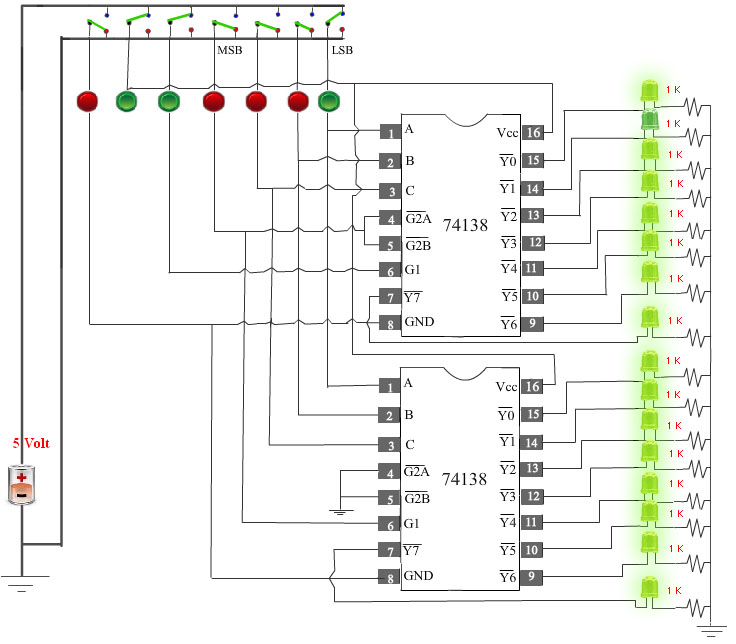
                                
4. Next,  apply  high level voltage to B  and apply low level voltage to all other select inputs (MSB,C, A ). Now check that Y2 (1st Decoder) is at low state. Other outputs are at high state.

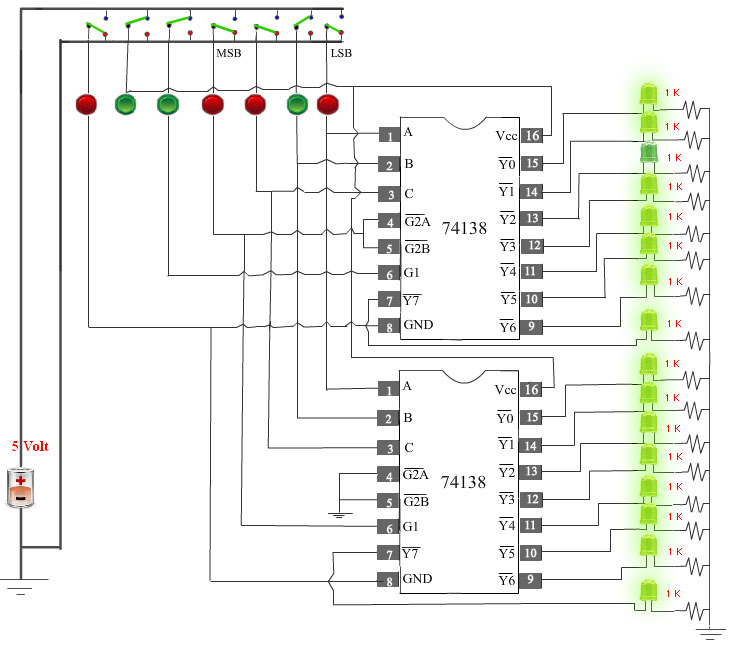
                            
5. Next, apply  high level voltage to A and B and apply low level voltage to all other select inputs (MSB,C )low. Now check that Y3 (1st Decoder) is at low state. Other outputs are at high state.

                                
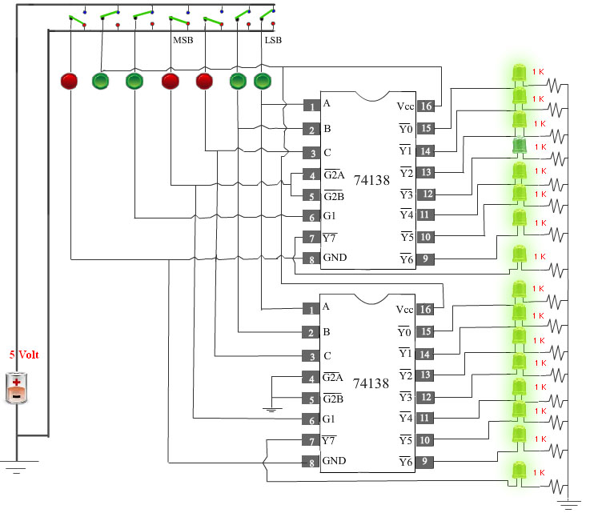
                               
6. Next,  apply high level voltage to C and apply low level voltage to all other select inputs (MSB,B,A ). Now check that
Y4 (1st Decoder) is at low state. Other outputs are at high state.

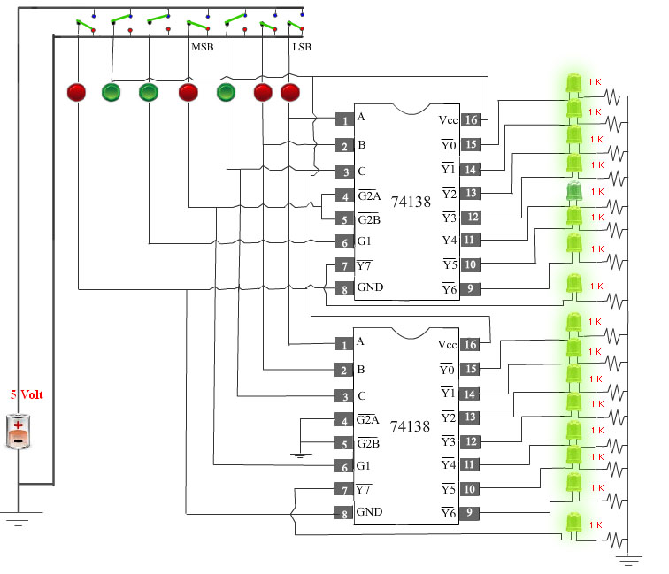
                               
7. Next, apply high level voltage to C  and A  and apply low level voltage to all other select inputs (MSB,B ).Now check that Y5 (1st Decoder) is at low state. Other outputs are at high state.

                                

                            
8. Next,  apply high level voltage to C  and B   and apply low level voltage to all other select inputs (MSB,A ). Now check that Y6 (1st Decoder) is at low state. Other outputs are at high state.
                                
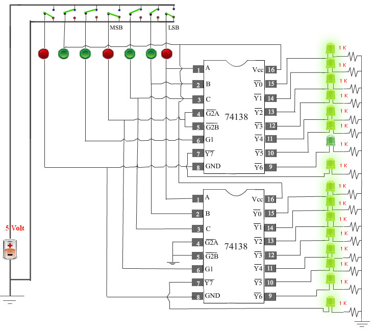
                             
9. Next,  apply high level voltage to C , B  and A high  and  apply low level voltage to   (MSB)input.  Now check that
Y7 (1st Decoder) is at low state. Other outputs are at high state.

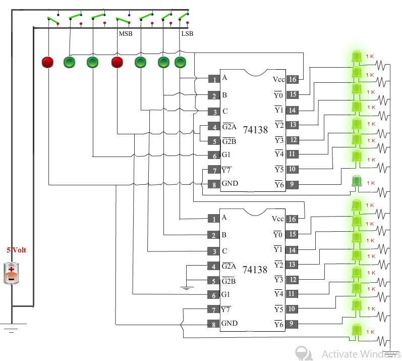
                               
10. Next, apply high level voltage to MSB  and  apply low level voltage to all other select inputs (C,B,A). Now check that
  Y0 (2nd Decoder) is at low state. Other outputs are at high state.
                         
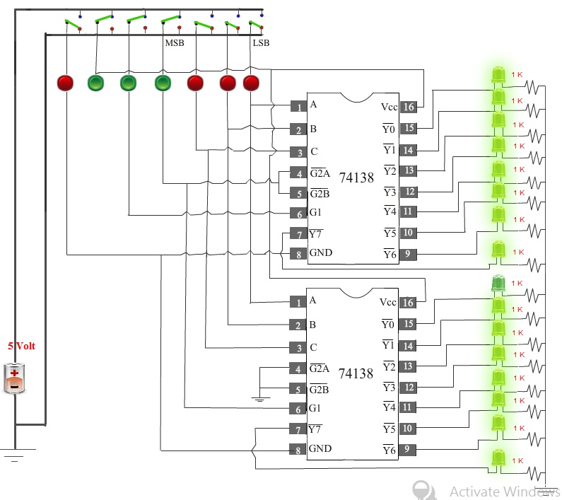
                            
11. Next, apply high level voltage to MSB and A  and apply low level voltage to all other select inputs (C,B).
  Now check that Y1(2nd Decoder) is at low state. Other outputs are at highstate.

 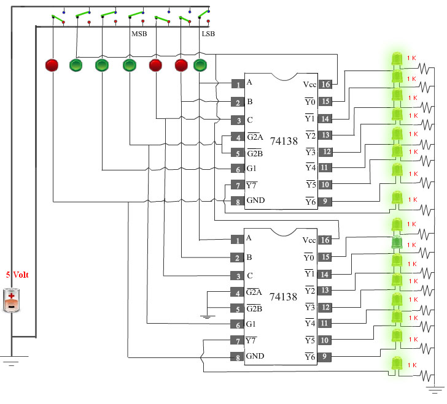
                              
12. Next,  apply high level voltage to MSB and B  and apply low level voltage to all other select inputs(C,A).
    Now check that Y2 (2nd Decoder) is at low state. Other outputs are at high state.
                                 
                            

                               
13. Next,  apply high level voltage to  MSB , B and A  and apply low level voltage to  the input (C). Now check that
    Y3 (2nd Decoder) is at low state. Other outputs are at high state.

                                

                                
14. Next,  apply high level voltage to MSB and C  and apply low level voltage to all other select inputs (B,A).
  Now check that Y4 (2nd Decoder) is at low state. Other outputs are at high state.

                                
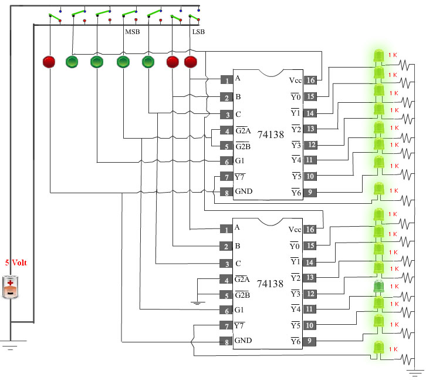
                            
15. Next,  apply high level voltage to MSB , C and A  and apply low level voltage to the select input (B). Now check that
  Y5 (2nd Decoder) is at low state. Other outputs are at high state.

                               
16. Next,  apply high level voltage to MSB , C and B  and apply low level voltage to  the input (A).Now check that
Y6 (2nd Decoder) is at low state. Other outputs are at high state.

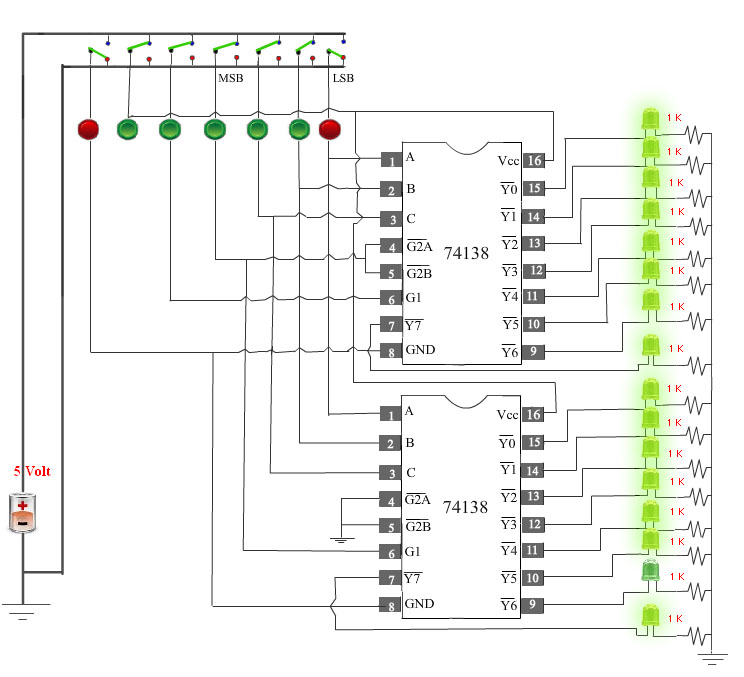
                                
17. Next,  apply high level voltage to all the select inputs (MSB,C,B,A). Now check that
  Y7 (2nd Decoder) is at low state. Other outputs are at high state.

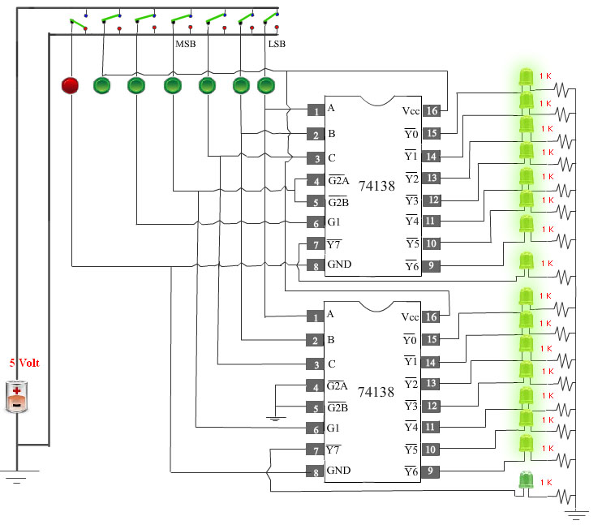
                              